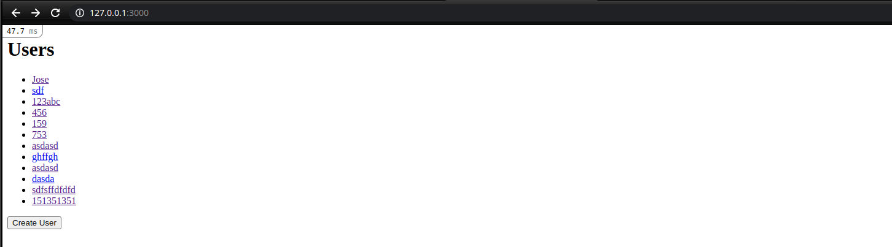

?style=plastic&logo=ruby-on-rails>)

# Ruby on Rails Project - Rails Forms

> The purpose of this project is to consolidate the acquired knowledge of the Ruby on Rails programming language. To do this, perform the following forms application.
> 

This web page was the second project of the Ruby on Rails programming language of the Microverse curriculum.
In this project, I learned the importance of forms applications and MVCs in developing real-world solutions.

## Built With

?style=plastic&logo=ruby-on-rails>)

## Getting Started

This project was created to study the importance of developing form application solutions, MVCs and their application in Ruby on Rails.

### Prerequisites

Computer running [Mac OS](https://www.apple.com/macos/big-sur/), [Windows](https://www.microsoft.com/en-us/software-download/windows10), or [Linux Ubuntu](https://ubuntu.com/download). [Ruby V.3.0.0](https://www.ruby-lang.org/es/downloads/)...

### Install

Getting Started
To get a locusing [VSCode](https://code.visualstudio.com/), first, you must [install it by following these steps](https://code.visualstudio.com/docs), then you must [open the folder containing my repository in your local repository](https://thisdavej.com/right-click-on-windows-folder-and-open-with-visual-studio-code/#:~:text=You%20can%20now%20navigate%20to,with%20VS%20Code%E2%80%9D%20as%20well.) and [open each of the files](https://code.visualstudio.com/docs/editor/editingevolved) to see their content.

- Download the repository on the local machine and place it in the directory of your preference, once this is done, open a terminal in the same location where the project is.
- To be able to work with Rails it is recommended to have the Ruby Version Manager "RVM" installed, if the simple steps that are reflected in the following pages to install it and to know how to use it in [Windows](https://gist.github.com/kirkelifson/2611affe02ce56ae6b04), [Mac](https://nrogap.medium.com/install-rvm-in-macos-step-by-step-d3b3c236953b) and [Ubuntu](https://www.digitalocean.com/community/tutorials/how-to-install-ruby-on-rails-with-rvm-on-ubuntu-18-04).
- Install and use Ruby version 3.0.1 from a terminal using the command `rvm install 3.0.1`, press enter, then type the command in your terminal` rvm use 3.0.1`, after that, verify that you have installed and using the version of Ruby 3.0.1, through the command `ruby --version` press enter and you should get an output similar to this` ruby 3.0.1p64 (2021-04-05 revision 0fb782ee38) [x86_64-linux] `with which you can verify the version you are using.
- Once your version is verified, you are going to do the following, install Ruby on Rails. It is as simple as running a command! `gem install rails`.
- Once the installation is complete, you can check if everything went well by restarting your terminal and executing the following command: `rails -v` this should display the version of Rails installed on your system indicating the installation went smoothly.
- Now we are going to install "yarn", Visit [The Yarn Download Page](https://classic.yarnpkg.com/en/docs/install#windows-stable) and from the dropdown box choose the operating system you are using. It will then present you with instructions on how to install Yarn. Follow the instructions step by step. You can verify the install by running the following command `yarn --version`.
- Now we will migrate the database with the command `rails db: migrate`.
- Now we are going to proceed to install the gems on our local machine through the `bundle install` command.
- Now, open a browser and visit `http://localhost:3000/` to see your application! Note: If you’re using a VM, you will need to open the browser inside of your VM in order for this to work.
- If you have any questions or problems about how to run this project, you can leave me a comment in the [issues section](https://github.com/aristides1000/rails-forms/issues) of this repository, I am more than willing to help you.

### Usage

Run the command `rails server` with [Ruby V.3.0.1](https://www.ruby-lang.org/es/downloads/).

### Run tests

Linters errors

## Author

👤 **Author**
Aristides Jose Molina Pérez

- GitHub: [@aristides1000](https://github.com/aristides1000)
- Twitter: [@aristides_1000](https://twitter.com/@aristides_1000)
- LinkedIn: [aristides jose molina perez](https://www.linkedin.com/in/aristides-jose-molina-perez-09b0579a)

## 🤝 Contributing

Contributions, issues, and feature requests are welcome!

Feel free to check the [issues page](https://github.com/aristides1000/rails-forms/issues).

## Show your support

Give a ⭐️ if you like this project!

## License

This project is [CC0-1.0](LICENSE) licensed.

## Acknowledgments

- Ariel Camus CEO Microverse: For letting us start this journey.
- Google: For letting us find crucial information in order to create this project.
